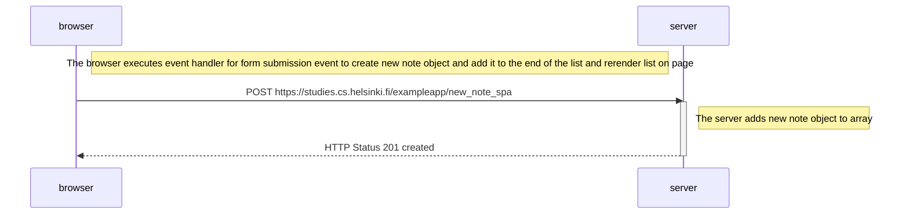

## Single Page Application New Note Diagram

```mermaid
sequenceDiagram
    participant browser
    participant server

    Note right of browser: The browser executes event handler for form submission event to create new note object and add it to the end of the list and rerender list on page
    browser->>server: POST https://studies.cs.helsinki.fi/exampleapp/new_note_spa
    activate server
    Note right of server: The server adds new note object to array
    server-->>browser: HTTP Status 201 created
    deactivate server
```